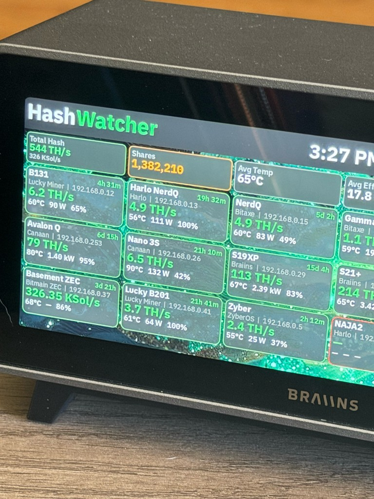
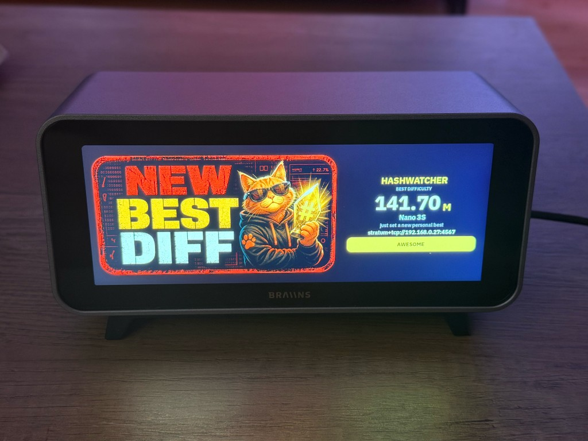
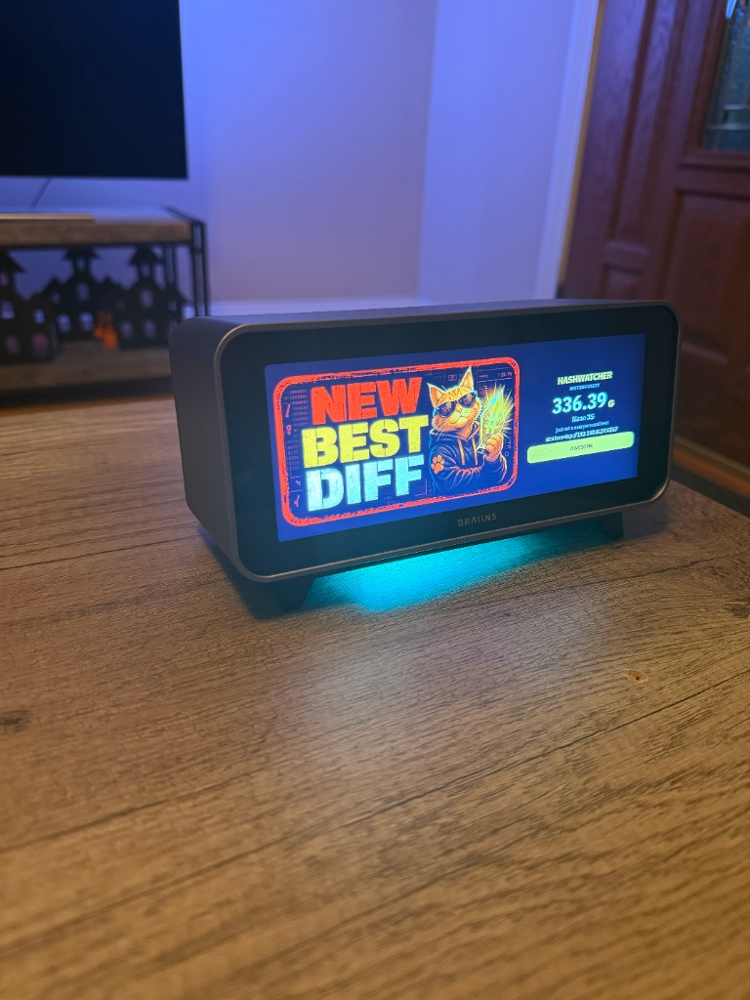

# HashWatcher for Braiins Deck

Birds Eye fleet, neural view, and miner dashboards as a Deck widget. Miners are sent from the HashWatcher app. This repository is the widget only.

Miner passwords are not in this repository. They are supplied at runtime by the app and are not stored here.

## Install the widget

Swipe down on the Deck for its IP address and open that address in a browser. On the Deck’s local page, click **Add New Widget** and choose **HashWatcher**.

If you don’t see it, try one of the options below.

If the app says to add the HashWatcher widget and send again, the widget is not on a Deck scene yet. Finish this step, then send again.

### Have an agent install it

Paste this to an agent on a computer that can reach the Deck. Swipe down on the Deck and copy the IP address shown there. Put that address where the prompt says `YOUR_DECK_IP`. That placeholder is not a Deck address, and an example address will install nothing on your Deck.

```text
Install the HashWatcher widget from https://github.com/gpena208777/hashwatcher-deck on my Braiins Deck at YOUR_DECK_IP.

SSH in as root. The password is blank unless I say otherwise. Build the crate at widgets-wasm/hashwatcher inside a BraiinsForge/bmc-main checkout, because it links the Deck SDK by relative path:

cargo build -p hashwatcher --target wasm32-unknown-unknown --release

Strip the wasm with bmc-wasm-assets, pack it as bmc-widget-hashwatcher, and install it with nix-store --add and bmc-nix-cli add-packages --name widget-hashwatcher --version 0.1.0.

Add one fullscreen scene for widget uid c4e8a1d2-7b63-4f0e-9a15-6d2b8f0c3e71. Keep every scene and setting already in /etc/bmc/config.json. Write the file, then run killall bmc-openwrt so the Deck reloads it. Leave other widgets installed.

Do not add miners and do not store miner passwords. I will send the fleet from HashWatcher for iOS 1.8.1 or later.
```

### Build it

This crate expects to live at `widgets-wasm/hashwatcher` inside [bmc-main](https://github.com/BraiinsForge/bmc-main), because it links the Braiins WASM SDK by relative path.

```bash
cargo build -p hashwatcher --target wasm32-unknown-unknown --release
```

## Add it to HashWatcher

HashWatcher for iOS **1.8.1 or later** is required. Earlier versions cannot send a fleet to the Deck.

Put the iPhone and the Braiins Deck on the same Wi-Fi. A Deck has no username. Leave the password blank unless you set one on the Deck.

After the widget is on a scene, add the Deck in the app using either path below. Then send the inventory. That replaces the roster on the Deck. Logins for Braiins and VNish miners go with the miners that need them.

### Add it from the Braiins device type

1. In HashWatcher, add a device and choose **Braiins**.
2. The form is labeled **Miner/Deck**. Enter a name and the Deck IP address.
3. Leave the password blank unless the Deck has one. The username field is for a Braiins OS miner, whose default username is root. A Deck does not use it.
4. Tap **Connect**.

HashWatcher saves the Deck and turns on the **Braiins Deck Remote** tile on Home.

### Add it from Braiins Deck Remote

1. If that tile is not on Home, open **Settings → Extra Features** and turn on **Braiins Deck Remote**.
2. Open **Braiins Deck Remote**.
3. Tap **Scan for a Deck**, or type the Deck IP address.
4. Leave the password blank unless the Deck has one, then tap **Continue**.

Hold the home tile and choose **Remove from HomeView** to hide it. The saved Deck stays. Turn **Braiins Deck Remote** back on under Extra Features to show the tile again.

A Deck row in Scan All is only a found address. Use one of the two paths above to save it.

## On a Deck



Fleet view with hashrate, shares, and per-miner cards.



Best-difficulty celebration. The popup stays up until Awesome is tapped.



The same celebration with the Deck LEDs running until Awesome is tapped.

## Notes

- Pool commands are read-only. The widget uses the CGMiner `pools` command and HTTP GETs. It does not send `addpool`, `switchpool`, or any other pool change.
- The Outbound traffic setting defaults to on. It is used only for weather data. When it is off, weather lookups stop and the weather screen saver explains why.
- License: GPL-3.0-or-later.
